# VIFM Assessment Center — User Guide

A custom-built Assessment Center management platform that runs the VIFM-AC Framework end-to-end: from engagement design and candidate management, through structured exercises and assessor observation, to wash-up consensus and a 6-page bilingual candidate report. Plus a self-serve learning track with AI-generated quizzes and a recommender that bridges every diagnostic gap to a VIFM training programme.

This guide walks through the full lifecycle for each role.

---

## Table of contents

1. [At a glance](#at-a-glance)
2. [Roadmaps](#roadmaps) — *the journey for each role*
   - [Consultant (admin) roadmap](#consultant-admin-roadmap)
   - [Assessor roadmap](#assessor-roadmap)
   - [Delegate (candidate) roadmap](#delegate-candidate-roadmap)
   - [Client roadmap](#client-roadmap)
3. [Detailed walkthroughs](#detailed-walkthroughs)
   - [Consultant — designing and running an engagement](#consultant--designing-and-running-an-engagement)
   - [Assessor — observing, rating, and consensus-building](#assessor--observing-rating-and-consensus-building)
   - [Delegate — completing the assessment journey](#delegate--completing-the-assessment-journey)
   - [Client — reading reports and acting on outputs](#client--reading-reports-and-acting-on-outputs)
4. [Reference](#reference)

---

## At a glance

| | |
|---|---|
| **Who uses it** | VIFM consultants/admins (run engagements), assessors (observe + rate), candidates/delegates (complete assessments), clients (read reports) |
| **Framework** | VIFM-AC: 4 domains (THINKING / RESULTS / PEOPLE / SELF), 8 clusters, 38 competencies, 249 behavioural indicators, 114 development tips |
| **Exercises** | In-Basket · Role Play · Group Exercise · Case Study · Oral Presentation · CBI |
| **Scoring** | BARS 1–5 per competency; Overall Assessment Rating (OAR) 1–5 → Ready Now / Ready with Development / Not Ready |
| **Reports** | 6-page bilingual candidate report + 4-page personalised Learning Plan (30/60/90-day roadmap + recommended VIFM programmes) |
| **Compliance** | UAE PDPL · Saudi PDPL · GDPR · ISO 10667 · ITF AC Guidelines (6th ed.) |

**Entry points by role:**

- `/admin` — admin/consultant portal (engagements, candidates, exercises, role profiles, courses)
- `/assessor` — assessor portal (assignments, observation, washup)
- `/candidate/welcome/[id]` — candidate entry (welcome → consent → assessments → skills → report)
- `/client` — client portal (engagements, candidates, analytics)

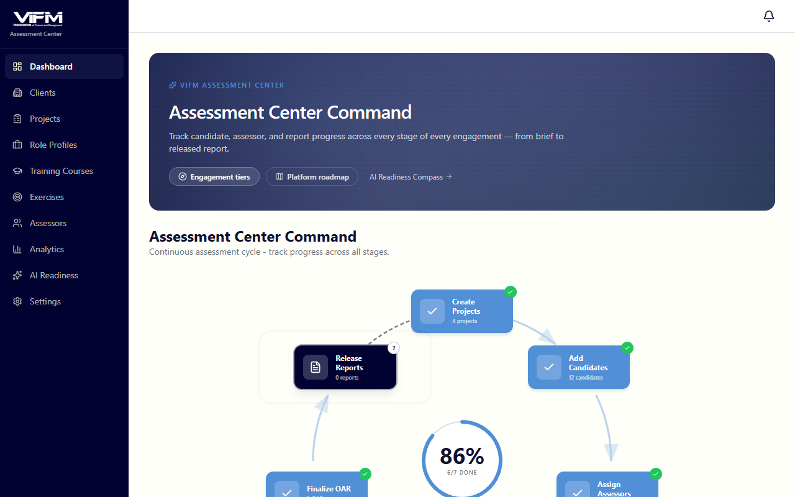

---

## Roadmaps

### Consultant (admin) roadmap

The end-to-end path for a VIFM consultant running an Assessment Center engagement. From client intake through report release.

```mermaid
flowchart LR
  A[Client intake<br/>brief + JD] --> B[Set up client org]
  B --> C[Engagement wizard<br/>5 steps]
  C --> D[Add candidates<br/>bind role profiles]
  D --> E[Assign assessors<br/>per exercise]
  E --> F[Candidate journey<br/>welcome · consent · exercises]
  F --> G[Assessor observation<br/>+ ratings]
  G --> H[Wash-up engine<br/>realtime consensus]
  H --> I[Review OAR<br/>recommendation]
  I --> J[Release report<br/>+ learning plan]
  J --> K[Re-engage cohort<br/>year-on-year]
```

**Key checkpoints:**

| Step | Where | Notes |
|---|---|---|
| Client org | `/admin/clients` | One organisation = one client account; engagements live under it |
| Engagement wizard | `/admin/engagements/new` | 5 steps. Step 2 includes the JD-to-competency extractor + role profile picker |
| Add candidates | Engagement detail · candidates tab | Per-row role-profile dropdown; CSV bulk import via `/admin/role-profiles/bulk-assign` |
| Assign assessors | `/assessor/assignments/[engagementId]` | Grid view: each row a candidate, each column an exercise |
| Wash-up | `/assessor/washup/[engagementId]/[candidateId]` | Realtime via Supabase Realtime; radar chart + colour-coded score summary |
| Release report | Engagement detail → "Release reports" | Sets per-candidate `report_status='released'` so candidates can view |
| Re-engage | Engagement detail → "Re-engage cohort" | Copies design + candidates with `prior_*_id` links → OAR delta pill on the new run |

### Assessor roadmap

The path for an assessor — receiving assignments, observing the candidate, capturing behavioural notes, scoring on BARS, building consensus with co-assessors.

```mermaid
flowchart LR
  A[Receive assignment<br/>email or dashboard] --> B[Open assignment<br/>/assessor/assignments]
  B --> C[Read briefing<br/>4 tabs]
  C --> D[Live or video<br/>observe candidate]
  D --> E[Behavioural notes<br/>AI-classifier per competency]
  E --> F[BARS rating<br/>1-5 or NE]
  F --> G[Q&A capture<br/>3 questions per competency]
  G --> H[Integration worksheet<br/>consolidate across exercises]
  H --> I[Wash-up session<br/>realtime consensus]
  I --> J[OAR recommendation]
```

**Per-exercise observation tabs (4):**

1. **Overview** — exercise type, candidate, target competencies, timing, brief
2. **Observe** — free-text behavioural notes with AI-suggested competency tags + +/- indicators
3. **Rate** — BARS scoring (1–5 or NE) per competency with strength + development split
4. **Q&A** — three question prompts per competency for follow-up dialogue

### Delegate (candidate) roadmap

The candidate-side journey — from the welcome email through the report.

```mermaid
flowchart LR
  A[Receive welcome email<br/>or token URL] --> B[Welcome page<br/>/candidate/welcome/id]
  B --> C[Consent form<br/>GDPR + UAE PDPL]
  C --> D[Assessment schedule<br/>exercises · timing]
  D --> E[Attend AC<br/>complete exercises]
  E --> F[Skills dashboard<br/>gap badges]
  F --> G[Self-serve quizzes<br/>per competency]
  G --> H[Wait for release]
  H --> I[Final report<br/>6 pages]
  I --> J[Learning Plan PDF<br/>30/60/90 + courses]
```

**What candidates see at each step:**

| Step | URL | Notes |
|---|---|---|
| Welcome | `/candidate/welcome/[id]` | Engagement details, role profile name, what to expect |
| Consent | `/candidate/consent/[id]` | GDPR / UAE PDPL form. Required before any data collection |
| Assessments | `/candidate/assessments/[id]` | Exercise schedule with timing |
| Skills dashboard | `/candidate/skills/[candidateId]` | Per-competency gap badges + 3-chart stats panel + Start AI Quiz buttons |
| Quiz | `/candidate/quiz/[attemptId]` | 7-question AI-generated quiz: 4 MCQ + 2 T/F + 1 cognitive pattern, 5-min timer |
| Quiz results | `/candidate/quiz/[attemptId]/results` | Score + per-question review with **AI explanations** in a Lightbulb tip box |
| Report | `/candidate/report/[id]` | Final 6-page bilingual report (gated until release) |
| Learning Plan | (download from report page) | 4-page React-PDF: Cover · 30/60/90 roadmap · per-competency cards · top-5 VIFM programmes |

### Client roadmap

The client-side path — sponsoring organisations review their cohort and act on the diagnostic.

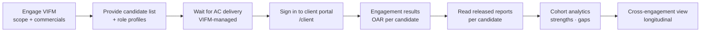

**What the client sees:**

- **Engagement list** — `/client/engagements` — all their engagements with VIFM
- **Engagement results** — `/client/engagements/[id]` — candidate roster with OAR + gap-severity badges
- **Reports** — `/client/reports` — cross-engagement report viewer
- **Analytics** — `/client/analytics` — cohort strengths and development areas

---

## Detailed walkthroughs

### Consultant — designing and running an engagement

#### 1. Sign in

`/admin` opens the admin/consultant portal. The collapsible sidebar shows the process map and module sections.

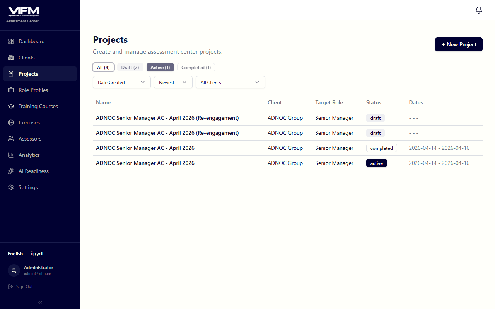

#### 2. Set up the client organisation

`/admin/clients`. Each client corresponds to one sponsoring organisation; engagements live under it.

#### 3. Create the engagement (5-step wizard)

`/admin/engagements/new`. The wizard walks through:

**Step 1 — Identity:** Engagement name · client org · target role · start/end dates.

**Step 2 — Competency profile:** Choose the competencies the AC will assess. Two paths:

**(a) JD-to-competency extractor.** Paste or upload a job description (Arabic or English, text or PDF). Claude extracts the most relevant 6–10 VIFM competencies and surfaces them with weight + priority + reasoning + a domain tally card (THINKING / RESULTS / PEOPLE / SELF chips with counts).

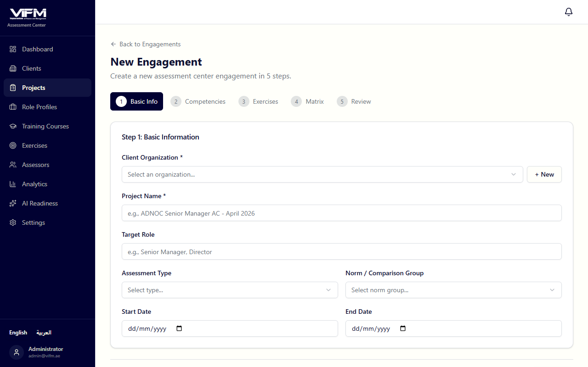

**(b) Role profile picker.** Reuse a pre-built competency pack from `/admin/role-profiles`. Six GCC banking + government profiles seeded; build your own via the Role Profile editor or bulk-import via `/admin/role-profiles/bulk-import`.

> Each competency must appear in at least 2 exercises (enforced by Zod validation) so the AC has triangulated evidence.

**Step 3 — Exercise selection:** Pick from the exercise library and tune the exercise-to-competency matrix.

**Step 4 — Assessors:** Assign assessors at the engagement level (specific exercise assignments come later).

**Step 5 — Review:** Final pass before save.

#### 4. Add candidates

On the engagement detail page → candidates tab.

For each candidate:

- Name + email
- **Role profile** (per-row dropdown) — drives the skill dashboard's target levels
- Demographic fields (department, gender, age range, seniority — optional)

CSV bulk-assign of role profiles by email at `/admin/role-profiles/bulk-assign`.

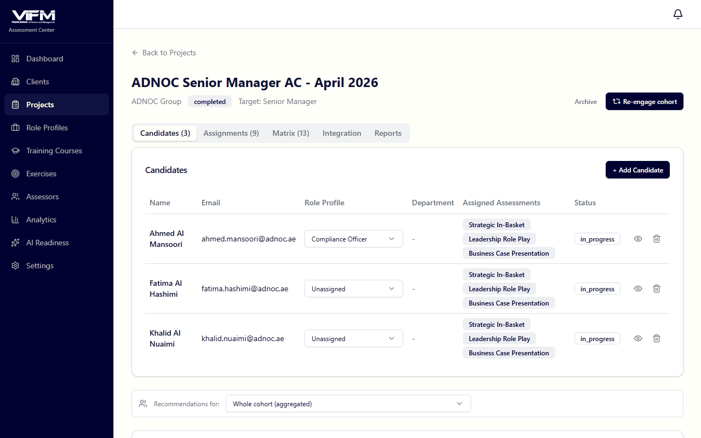

The candidates table also shows:

- **Per-row "view as candidate" eye icon** — opens `/candidate/welcome/[id]?asAdmin=1` in a new tab with an amber banner, lets you see exactly what the candidate sees
- **OAR delta pill** — when this is a re-engagement run (G7), shows ↑+1 / ↓-1 vs the prior assessment
- **Gap-severity badges** when scores are in

#### 5. Assign assessors per exercise

`/assessor/assignments/[engagementId]`. Grid view — rows = candidates, columns = exercises. Click a cell to assign an assessor.

#### 6. Monitor the engagement

The engagement detail page shows progress. Below the candidates table:

- **VIFM training recommendations panel** — cohort-aggregated gaps × course relevance. Use a `?candidate=<id>` URL filter to switch to per-candidate view
- **Notifications bell** in the header — rose unread badge; popover shows the 20 newest items (e.g., a candidate completed a quiz)

#### 7. Wash-up engine

After all assessors have rated, run the wash-up at `/assessor/washup/[engagementId]/[candidateId]` (consultants are typically present too).

Features:

- **Supabase Realtime** — multiple users see edits live without refresh
- **Radar chart** of consensus ratings vs target
- **Colour-coded score summary** — strengths in emerald, gaps in rose
- Per-competency consensus discussion + final score
- **OAR recommendation** — drops out of the consensus discussion

#### 8. Release the report

Once the OAR is set, on the engagement detail click *Release reports*. This flips per-candidate `report_status='released'`, allowing candidates to access their reports.

The 6-page bilingual report is generated on demand at `/api/reports/[engId]/[candId]/pdf`:

1. Cover
2. About AC (methodology)
3. Summary (overall + competency table with **gap-severity badges**)
4. Per-competency detail with strength/development split
5. Development recommendations
6. (Stage extension) Year-on-year if applicable

#### 9. Re-engage the cohort

Engagement detail header → *Re-engage cohort* (visible when status is `completed` or `archived`). Modal asks whether to carry candidates; on confirm:

- Copies the engagement design (competencies, exercises, exercise-competency matrix)
- Copies the candidates (preserving role-profile binding, demographics) with `prior_candidate_id` links
- Does NOT copy assessor assignments, observations, ratings, reports — the new run scores fresh
- OAR delta pill renders on each candidate row once the new run scores

#### 10. Curate VIFM courses + role profiles + exercises

For ongoing maintenance:

- **`/admin/courses`** — VIFM training catalogue (127 imported as of Apr 2026). Drag-and-drop AI extraction at `/admin/courses/import`. Per-course AC competency + ARA pillar mapping. Levenshtein duplicate-finder at `/admin/courses/duplicates`.
- **`/admin/role-profiles`** — reusable competency packs. Bulk-import JDs at `/admin/role-profiles/bulk-import`. JSON export at `/api/role-profiles/[id]/export`.
- **`/admin/exercises`** — exercise library with 4 detail tabs (Overview · Briefing · Timing · Role-player guides).
- **`/admin/analytics`** — ICC inter-rater reliability, bias detection, Recharts visualisations.

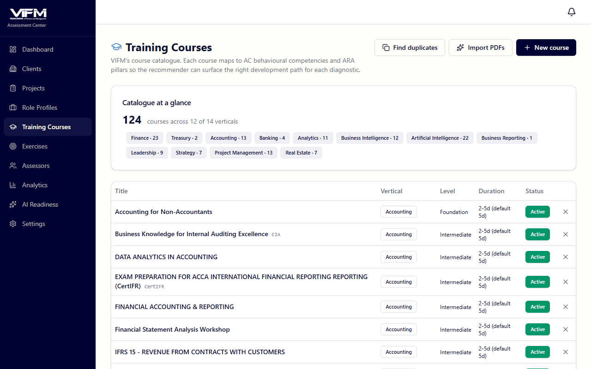

---

### Assessor — observing, rating, and consensus-building

#### 1. Open the assessor portal

`/assessor/assignments` — engagement picker + assignment grid.

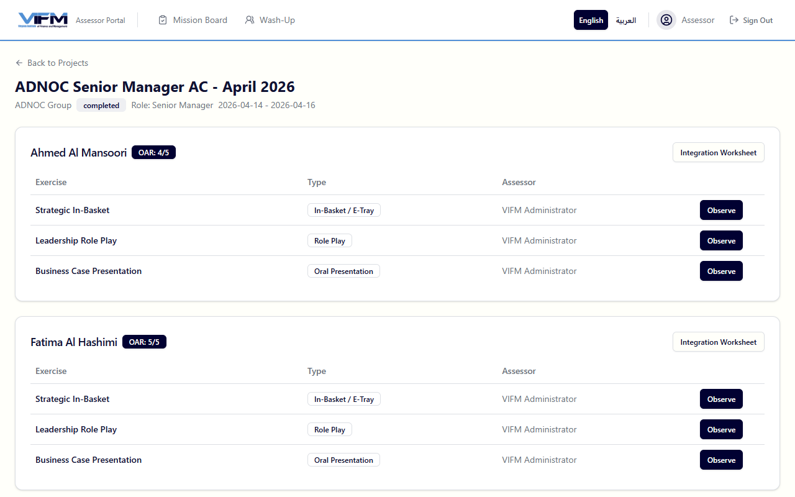

The grid shows rows for candidates and columns for exercises. Each cell is your observation slot — *Observe* button opens the 4-tab observation form.

#### 2. Observation form (4 tabs)

`/assessor/observation/[assignmentId]`.

**Tab 1 — Overview:** Exercise type, candidate, target competencies, timing breakdown (instructions / prep / meeting), participant brief, scenario context.

**Tab 2 — Observe:** Free-text behavioural notes. As you type, an AI classifier suggests the closest VIFM competency and a +/- indicator. You can override; suggestions are advisory.

**Tab 3 — Rate:** BARS 1–5 per competency, plus *NE* (No Evidence). Strength notes and development notes split visually so the wash-up has anchored evidence.

| BARS | Label |
|---|---|
| 5 | Significant Strength |
| 4 | Strength |
| 3 | Competent |
| 2 | Development Needed |
| 1 | Significant Development Needed |
| NE | No Evidence |

**Tab 4 — Q&A:** Three question prompts per competency for follow-up dialogue with the candidate.

#### 3. Integration worksheet

After observing all your assigned exercises for a candidate, run the integration worksheet at `/assessor/integration/[engagementId]/[candidateId]`. This is your pre-wash-up consolidation — a unique constraint at the DB level prevents duplicates per (engagement, assessor, candidate, competency).

#### 4. Wash-up

`/assessor/washup/[engagementId]/[candidateId]`. Joint session with co-assessors. Realtime consensus → final consensus score per competency → OAR recommendation.

The wash-up is the single most important differentiator of the VIFM AC method — bring observed evidence, listen, integrate, agree.

---

### Delegate — completing the assessment journey

#### 1. Welcome page

`/candidate/welcome/[id]`. Personalised greeting with engagement details, role profile name, and what to expect.

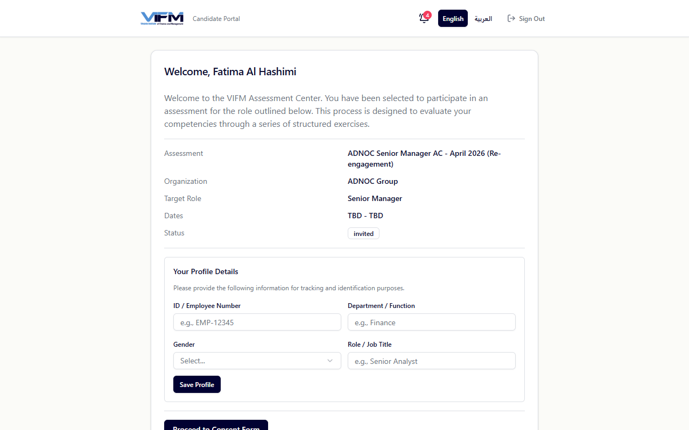

#### 2. Consent form

`/candidate/consent/[id]`. GDPR / UAE PDPL consent. Required before any further data collection. Admins can see whether candidates have consented in the engagement detail.

#### 3. Assessment schedule

`/candidate/assessments/[id]`. Shows the scheduled exercises with timing. The actual Assessment Center is run in person or via video — this page is the briefing.

#### 4. Skills dashboard

`/candidate/skills/[candidateId]`. Linked from the post-consent welcome page.

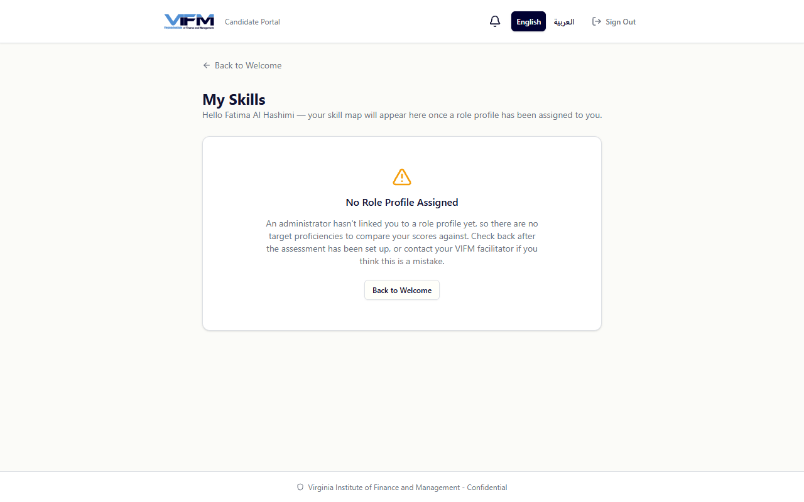

What's on this page:

- **4 stat cards** — Total · Assessed · Skills with Gaps · Average Score
- **Personal-statistics charts** — Assessment Progress donut · Skills by Domain donut · Average Score by Domain bar chart (4 VIFM domain colours: THINKING blue / RESULTS green / PEOPLE orange / SELF violet)
- **Per-skill cards** grouped by VIFM domain with target / current BARS / gap badge
- **Start AI Quiz button** on each skill card

#### 5. Self-serve AI quiz

Click *Start AI Quiz* on any skill card → `/candidate/quiz/[attemptId]`.

- **7 questions** mixing 4 multiple-choice + 2 true/false + 1 cognitive pattern-recognition
- **Mixed difficulty** — Easy / Medium / Hard pills
- **5-minute timer** with graceful "End Session" option
- Bilingual EN/AR via i18n

Results page (`/candidate/quiz/[attemptId]/results`):

- Score circle + 3 stat cards
- Per-question review with **AI-generated explanation in a Lightbulb tip box** — the highest-value learning moment
- *Retake quiz* button if the candidate wants another attempt with fresh AI-generated questions

#### 6. Notifications bell

In the header of every `/candidate/*` page. Rose unread badge. Click for the 20 newest items (e.g., role-profile bound, quiz completed, report released).

#### 7. Final report

`/candidate/report/[id]`. Gated behind `report_status='released'` per-candidate. Shows:

- 6-page bilingual report
- Two PDF downloads: **Full report** (`/api/reports/[engId]/[candId]/pdf`) and **Learning Plan** (`/api/reports/[engId]/[candId]/learning-plan`)

The report uses **gap-severity badges** to communicate where the candidate stands per competency: Significant Gap (N levels) · On Target · Strength.

#### 8. Learning Plan PDF

A 4-page React-PDF personalised plan:

1. **Cover** — candidate name, engagement, generation date
2. **30/60/90-Day Roadmap** — concrete actions per phase
3. **Per-competency action cards** with `<GapPill>` mirroring the on-screen badges
4. **Top-5 recommended VIFM programmes** with ★ HIGH FIT badges, per-driver chips, AI rationale

---

### Client — reading reports and acting on outputs

#### 1. Sign in

`/client`. Top nav with process map.

#### 2. Engagement list

`/client/engagements`. All your engagements with VIFM. Click one to see its candidate roster.

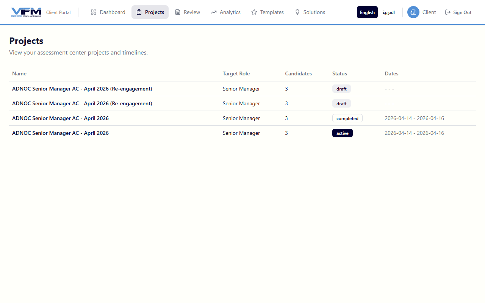

#### 3. Engagement detail

`/client/engagements/[id]`. Per-candidate row with:

- Name + role
- OAR (Ready Now / Ready with Development / Not Ready)
- **Gap-severity badges** for top 3 gaps
- Download links for each candidate's released report + Learning Plan

#### 4. Reports

`/client/reports`. Cross-engagement report viewer — useful for clients with multiple engagements over time.

#### 5. Analytics

`/client/analytics`. Cohort-level strengths and development areas with Recharts visualisations.

---

## Reference

### The VIFM-AC Framework

| Layer | Count |
|---|---|
| Domains | 4 (THINKING · RESULTS · PEOPLE · SELF) |
| Clusters | 8 |
| Competencies | 38 |
| Behavioural indicators | 249 (positive + negative per competency) |
| Development tips | 114 (3 per competency) |
| Tags | 5 per competency |
| Q&A questions | 3 per competency |

### BARS scale

| Score | Label |
|---|---|
| 5 | Significant Strength |
| 4 | Strength |
| 3 | Competent |
| 2 | Development Needed |
| 1 | Significant Development Needed |
| NE | No Evidence |

### Overall Assessment Rating (OAR)

| OAR | Recommendation |
|---|---|
| 4–5 | **Ready Now** |
| 3–3.99 | **Ready with Development** |
| < 3 | **Not Ready** |

### Gap-severity badges

Computed as `target - current` on the consensus rating:

| Gap | Tone | Label |
|---|---|---|
| ≥ 2 levels | rose | Significant Gap (N levels) |
| 1 level | amber | Gap |
| 0 | neutral | On Target |
| -1 | sky | Slight Strength |
| ≤ -2 | emerald | Strength |

### Compliance & retention

- UAE Federal Decree-Law No. 45 of 2021 (Data Protection)
- Saudi Arabia PDPL
- GDPR for EU/UK operations
- ISO 10667 — Assessment of People in Work and Organisational Settings
- International Taskforce on Assessment Center Guidelines (6th Edition)
- **Default retention:** 2 years post-engagement (extendable contractually)
- Audit trail on all significant actions (immutable)

### URL map

| URL | Who | Purpose |
|---|---|---|
| `/admin` | Admin | Process map dashboard |
| `/admin/clients` | Admin | Client orgs |
| `/admin/engagements` | Admin | Engagement list |
| `/admin/engagements/new` | Admin | 5-step engagement wizard |
| `/admin/engagements/[id]` | Admin | Engagement detail (candidates, recommendations, analytics) |
| `/admin/exercises` | Admin | Exercise library |
| `/admin/role-profiles` | Admin | Reusable competency packs |
| `/admin/role-profiles/bulk-import` | Admin | Drag-drop multi-JD AI extraction |
| `/admin/role-profiles/bulk-assign` | Admin | CSV email-to-role-profile linker |
| `/admin/courses` | Admin | VIFM training catalogue |
| `/admin/courses/import` | Admin | AI PDF course extraction |
| `/admin/courses/duplicates` | Admin | Levenshtein near-match finder |
| `/admin/courses/[id]` | Admin | Course detail + AC/ARA tag mapping |
| `/admin/analytics` | Admin | ICC, bias detection, Recharts |
| `/admin/settings` | Admin | Integration status, compliance, env info |
| `/assessor/assignments/[engagementId]` | Assessor | Candidate × exercise grid |
| `/assessor/observation/[assignmentId]` | Assessor | 4-tab observation form |
| `/assessor/integration/[engagementId]/[candidateId]` | Assessor | Pre-wash-up consolidation |
| `/assessor/washup/[engagementId]/[candidateId]` | Assessor | Realtime consensus engine |
| `/candidate/welcome/[id]` | Candidate | Welcome page |
| `/candidate/consent/[id]` | Candidate | GDPR / UAE PDPL consent |
| `/candidate/assessments/[id]` | Candidate | Schedule |
| `/candidate/skills/[candidateId]` | Candidate | Skills dashboard with quizzes |
| `/candidate/quiz/[attemptId]` | Candidate | AI quiz interface |
| `/candidate/quiz/[attemptId]/results` | Candidate | Score + AI explanations |
| `/candidate/report/[id]` | Candidate | Final 6-page bilingual report |
| `/api/reports/[engId]/[candId]` | Candidate / Client | Full report PDF |
| `/api/reports/[engId]/[candId]/learning-plan` | Candidate / Client | 4-page Learning Plan PDF |
| `/client/engagements` | Client | Engagement list |
| `/client/engagements/[id]` | Client | Candidate roster + OAR |
| `/client/reports` | Client | Cross-engagement viewer |
| `/client/analytics` | Client | Cohort strengths + gaps |

---

*Last updated: 2026-04-29.*
