# VIFM AI Readiness Compass — User Guide

A bilingual (EN / AR) diagnostic platform that measures how ready an organisation — or an individual — is to make AI work in the GCC context. Calibrated against UAE and Saudi regulatory frameworks, scored across 8 organisational pillars and 4 personal factors, and packaged in a board-grade bilingual PDF report.

This guide walks through the full lifecycle for each role.

---

## Table of contents

1. [At a glance](#at-a-glance)
2. [Roadmaps](#roadmaps) — *the journey for each role*
   - [Consultant roadmap](#consultant-roadmap)
   - [Delegate (respondent) roadmap](#delegate-respondent-roadmap)
   - [Client roadmap](#client-roadmap)
3. [Detailed walkthroughs](#detailed-walkthroughs)
   - [Consultant — running an organisational engagement](#consultant--running-an-organisational-engagement)
   - [Delegate — completing a respondent survey](#delegate--completing-a-respondent-survey)
   - [Personal — taking the free snapshot](#personal--taking-the-free-snapshot)
   - [Client — receiving and using the report](#client--receiving-and-using-the-report)
4. [Admin tasks](#admin-tasks) — *curating the knowledge base*
5. [Reference](#reference)

---

## At a glance

| | |
|---|---|
| **Who uses it** | VIFM consultants (run engagements), respondents/delegates (answer the survey), client sponsors (read reports), admins (curate question bank, regulatory docs) |
| **Languages** | English + Gulf Arabic with full RTL support |
| **Stages** | Personal · Department · Division · Enterprise |
| **Scoring** | 1–5 maturity scale on 8 organisational pillars (Strategy, Data, Technology, Talent, Culture, Governance, Operations, Model Management) and 4 personal factors (AI Sense-Check, AI Working Practice, AI Collaboration, AI Adaptive Mindset) |
| **Output** | Bilingual PDF report (8–60 pages depending on stage) + Personal Snapshot 1-page PDF |
| **Region calibration** | UAE (PDPL, NCA ECC, etc.) · Saudi Arabia (SDAIA NDGF, DCAI, ADDA, Vision 2030, etc.) — 16 frameworks, 56 mapped requirements |

**Entry points:**

- `/ara` — public landing page
- `/ara/engage` — sales pitch / stage comparison
- `/ara/personal/start` — free Personal Snapshot (anonymous, self-served)
- `/ara/consultant` — consultant dashboard
- `/ara/admin` — admin console (question bank, regulatory docs, retention)
- `/ara/respond/[token]` — respondent survey (token-gated, no account required)

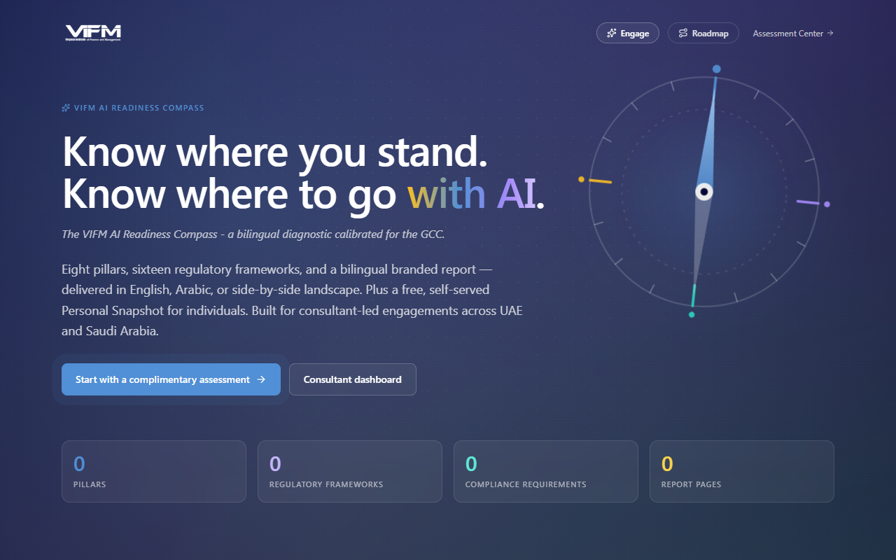

---

## Roadmaps

### Consultant roadmap

The end-to-end path for a VIFM consultant running an organisational AI Readiness engagement. From client intake to report delivery.

```mermaid
flowchart LR
  A[Client intake<br/>brief + scope] --> B[Create organisation<br/>region · sector]
  B --> C[Create assessment<br/>stage · weights · tier]
  C --> D[Add respondents<br/>roles · pillars]
  D --> E[Issue invitations<br/>tokens · email]
  E --> F[Monitor progress<br/>auto-save · distortion]
  F --> G{{Stage 2/3?}}
  G -->|Yes| H[Phase 2 workshop<br/>Layer 2 questions]
  G -->|No| I[Auto-scored maturity bands]
  H --> I
  I --> J[Validate scores<br/>consultant notes]
  J --> K[Generate bilingual PDF<br/>EN · AR · side-by-side]
  K --> L[Deliver to client<br/>walkthrough optional]
  L --> M[Annual reassessment<br/>copy-and-create]
```

**Key checkpoints:**

| Step | Where | Notes |
|---|---|---|
| Create assessment | `/ara/consultant/assessments/new` | 2-step wizard. Stage drives pillar count, report length, fee model |
| Add respondents | Assessment detail · *Respondents* tab | Each respondent gets an `access_token` URL — no account needed |
| Issue invitations | *Respondents* tab → "Send invitation" | Bilingual EN/AR/bilingual email; sandbox redirects in dev |
| Monitor progress | Assessment detail · *Progress* | Per-respondent completion %, last seen, distortion warnings |
| Validate scores | Assessment detail · *Phase 2* tab | Edit each pillar's validated score and add bilingual consultant notes |
| Generate report | "Generate PDF" button → `/api/ara/reports/[id]/pdf?language=...` | Pick EN, AR, or side-by-side (Stage 3 only) |
| Annual reassessment | Detail page → "Start reassessment" | Copies design + opt-in respondent carry-over |

### Delegate (respondent) roadmap

The path for a person answering the survey — whether on behalf of an organisation (Mode B / C) or as a free Personal Snapshot (Mode A).

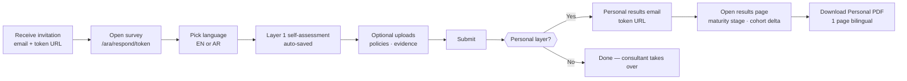

**Three deployment modes for delegates:**

| Mode | Stage | Items | Issued by |
|---|---|---|---|
| **A — Free snapshot** | `individual` snapshot | 24 (6 / factor) | Self-served at `/ara/personal/start` |
| **B — Paid deep-dive** | `individual` deep-dive | 48 (12 / factor) | Consultant at `/ara/consultant/personal-deep-dive/new` |
| **C — Org-engagement layer** | dept/division/enterprise + `include_individual_layer=true` | Pillars + 24 or 48 personal items | Consultant on the org wizard |

### Client roadmap

The client-side path is intentionally small — VIFM controls report delivery to keep narrative integrity.

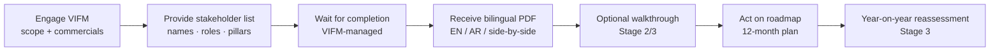

**What the client receives:**

- Bilingual PDF report (8 pages Stage 1, 27 pages Stage 2, 27–60 pages Stage 3)
- Side-by-side EN/AR landscape format on Stage 3
- Optional walkthrough session led by the VIFM consultant
- Year-on-year reassessment package on Enterprise tier

> ℹ️ **There is no client-facing portal in the ARA module today.** The client receives the PDF directly. A self-service browse + quote portal is on the roadmap — see [post-parity-roadmap.md](post-parity-roadmap.md).

---

## Detailed walkthroughs

### Consultant — running an organisational engagement

#### 1. Sign in to the consultant dashboard

Navigate to `/ara/consultant`. This is the home for all your engagements. Personal-layer assessments (engagement_stage = `individual`) are filtered out — those live in their own panel near the bottom.

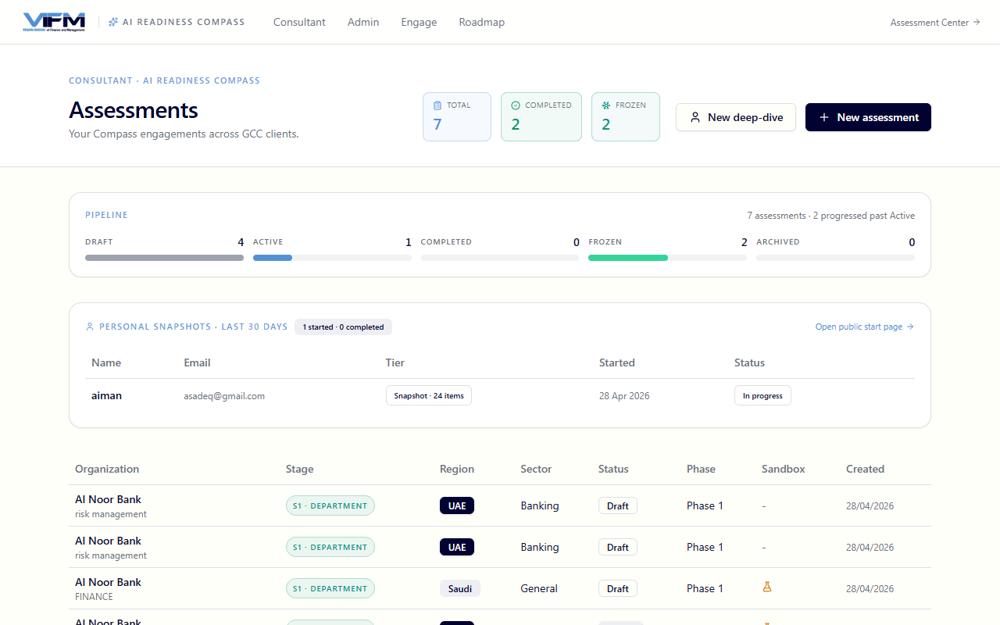

What you see here:

- **Active assessments** — drafts, in-progress, ready-to-validate, ready-to-publish
- **Personal snapshots — last 30 days** (panel) — separate from org engagements; shows snapshot vs deep-dive distinction
- **Quick actions** — *New assessment*, *New deep-dive*, *Year-on-year reassessment*

#### 2. Create the client organisation

Before creating an assessment you need an organisation record. Go to `/ara/admin/organizations`.

Required fields:

- **Name** (EN) — anonymisable for case studies
- **Name (AR)** — optional but recommended
- **Region** — `uae` or `saudi`. Drives which regulatory frameworks appear.
- **Sector** — banking · government · corporate · etc.

> ⚠️ Region is locked once you start collecting respondent answers — set it correctly upfront.

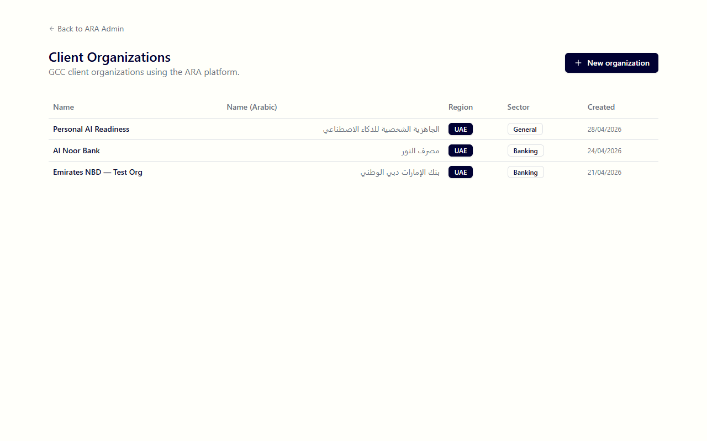

#### 3. Create the assessment

Click *New assessment* from the consultant dashboard, or visit `/ara/consultant/assessments/new`.

**Step 1 — pick a stage:**

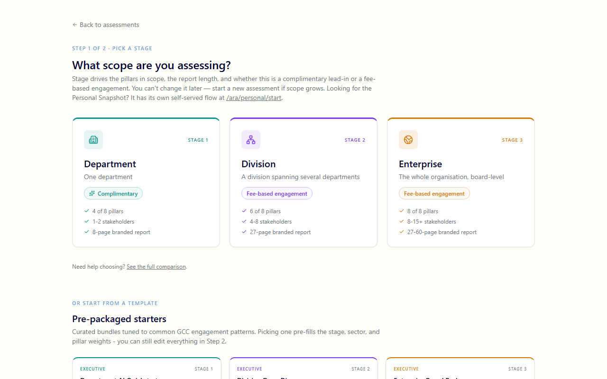

Personal is filtered out of this picker (it has its own self-served flow). Choose between Department / Division / Enterprise.

Pre-packaged starter templates appear below the stage cards — picking one pre-fills stage, region, sector, and pillar weights.

**Step 2 — configure the assessment:**

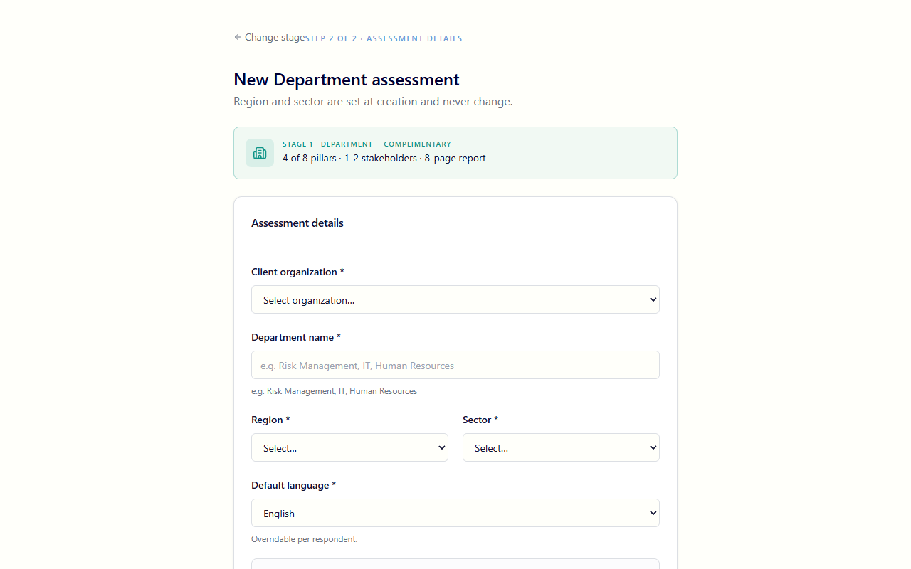

Key fields:

- **Organisation** — pick from dropdown
- **Region / Sector** — defaulted from the organisation; locked at creation
- **Default language** — what the respondent form opens in (they can still toggle)
- **Question bank version** — defaulted to the active version
- **Scope label** — required for Department/Division (e.g., "Risk Management"), optional for Enterprise
- **Include individual layer (Mode C)** — opt in to a per-respondent personal-readiness rollup alongside the org pillar items
- **Tier** — `snapshot` (24 personal items) or `deep_dive` (48). Only relevant when individual layer is on
- **Sandbox** — toggle on for training/demo runs; protects real consultant dashboards from clutter

#### 4. Add respondents

On the assessment detail page → *Respondents* tab.

For each respondent:

- Name (EN + AR)
- Email
- Role (e.g., "CIO", "Head of Risk")
- Language preference (EN / AR)
- Pillar assignments — which of the 8 pillars they should answer for. Stage 1 has 4 in scope, Stage 2 has 6, Stage 3 has all 8.
- **Individual-only flag (Mode C)** — when ticked, the respondent skips the pillar items and only answers the 4-factor personal layer

CSV import is also supported — paste or upload `name, email, role, language, pillar_assignments` and the wizard validates row by row.

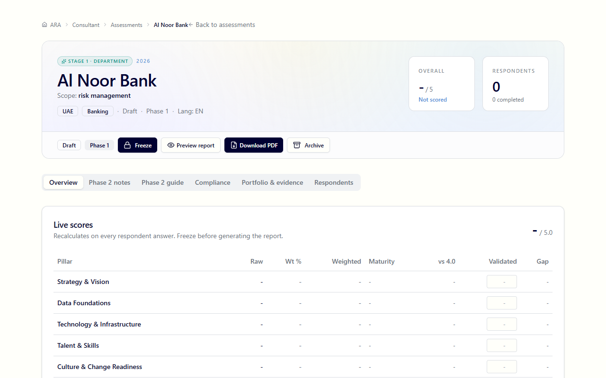

#### 5. Issue invitations

Tick the respondents you want to invite, click *Send invitations*. The system:

1. Generates a unique `access_token` for each
2. Sends a bilingual email (EN / AR / side-by-side) via Microsoft Graph
3. Logs the send to `ara_email_log` for audit
4. (In sandbox or when `SANDBOX_EMAIL_REDIRECT` is set) routes to a single email for testing

#### 6. Monitor progress

The *Progress* panel on the detail page shows a per-respondent table:

- Status — `not_started` · `in_progress` · `completed`
- % complete
- Last seen
- Distortion warnings — if a respondent's pattern looks like uniform-tap or speed-clicking, a flag appears here for the consultant to address

#### 7. Phase 2 workshop (Stage 2 / 3 only)

For Division and Enterprise stages, after Layer 1 self-assessment is complete the consultant runs a Phase 2 validation workshop. This is the *Phase 2* tab on the assessment detail.

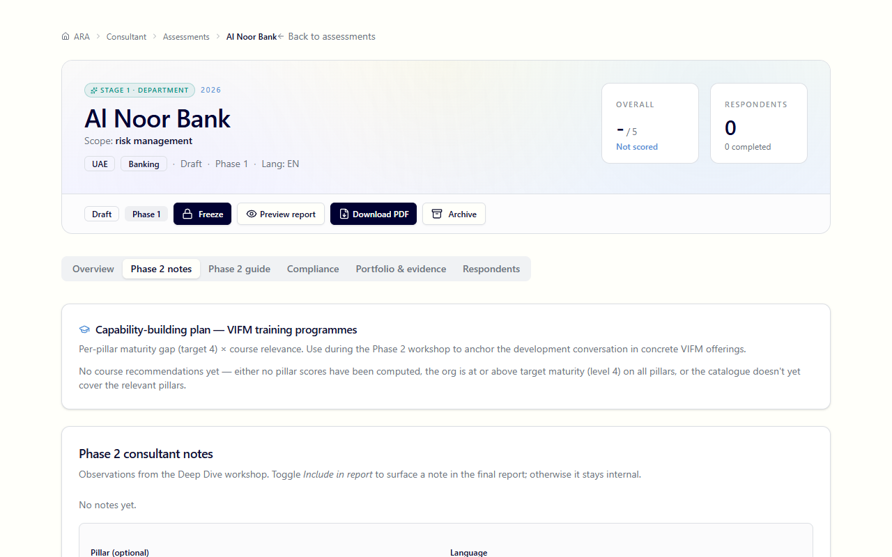

What's in this tab:

- **Layer 2 consultant guide questions** — bilingual probing questions per pillar to dig into the gap between perception (Layer 1) and observed reality
- **Validated scores** — for each pillar, edit the auto-scored maturity band based on workshop findings
- **Bilingual consultant notes** — write findings; if you write in EN the system translates to AR via Claude on save (you can edit the AR after)
- **Capability-building plan** — VIFM course recommender ranked by per-pillar gap × course relevance
- **Workforce readiness rollup card** — appears when Mode C is on; cohort overall + 4 factor cards + per-respondent breakdown table + a development-demand histogram (% of cohort below target per factor)

#### 8. Generate the PDF report

Click *Generate report* → `/api/ara/reports/[id]/pdf?language=en|ar|bilingual`.

- **English** — portrait, 8 pages (Stage 1) to 60 pages (Stage 3)
- **Arabic** — same layout, RTL, with proper Arabic shaping via Puppeteer
- **Side-by-side bilingual** — landscape, each page split EN | AR (Stage 3 only)

The Workforce AI Readiness section appears in the PDF when `include_individual_layer=true` and respondents have answered.

#### 9. Deliver and re-engage

Once generated, the PDF stays attached to the assessment record (it survives even if the assessment is later archived — VIFM business records per retention §15.3). Deliver to the client out-of-band (email, secure file share).

For year-on-year, on the assessment detail action rail click *Start reassessment* — copies the design (org, stage, weights, scope) into a new draft and gives you the option to carry over the same respondents (with fresh tokens). The new assessment links back via `prior_assessment_id`.

---

### Delegate — completing a respondent survey

#### 1. Receive the invitation

The respondent receives a bilingual email with a unique token URL. The link looks like `https://your-tenant.vifm.ae/ara/respond/<token>`. No account or login is needed — the token is the credential.

#### 2. Open the survey

Clicking the link opens the respondent form. The first prompt asks for language preference (EN or AR), defaulted from what the consultant configured.

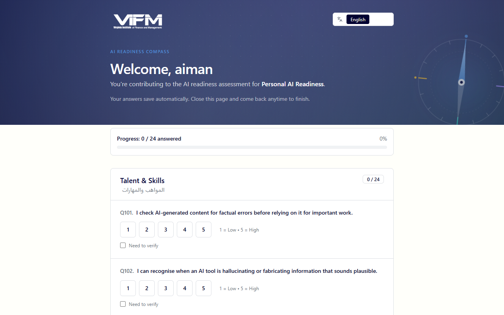

#### 3. Answer the questions

The form serves Layer 1 questions for the pillars you were assigned, plus (if Mode C is on) the four-factor personal items.

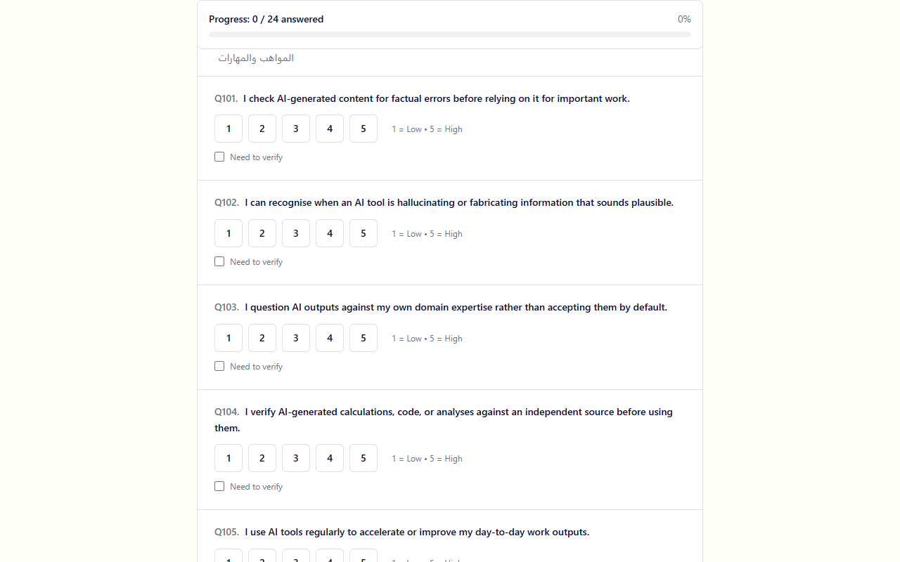

Features the respondent gets:

- **Auto-save** — every answer saves immediately. Close the tab and come back any time using the same link.
- **Offline detection** — if the network drops, a banner appears and the form caches answers locally
- **Language toggle** — switch EN ↔ AR mid-survey without losing progress
- **Supporting materials** — optional uploads per pillar (no size limit) for evidence (policies, training records, etc.)
- **AI use-case portfolio** — for Stage 2/3 respondents, list the AI initiatives currently in play

#### 4. Submit

Once every required item is answered, the *Submit* button enables. After submission:

- The token still works for read-only access (you can re-open and download a copy if entitled)
- For Personal / Mode C respondents — a results email fires with a link to your personal snapshot

---

### Personal — taking the free snapshot

The free Mode A path. Anonymous self-served at `/ara/personal/start`.

#### 1. Start the snapshot

Visit `/ara/personal/start`. Enter your name + email (used only to email you the results link — no account is created).

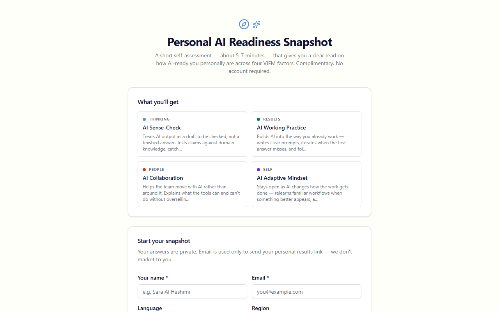

#### 2. Answer 24 four-factor items

The 24-item snapshot covers the four VIFM-native personal factors:

- **AI Sense-Check** (THINKING) — critical evaluation of AI output
- **AI Working Practice** (RESULTS) — hands-on use of AI in real work
- **AI Collaboration** (PEOPLE) — leading or supporting team adoption
- **AI Adaptive Mindset** (SELF) — curiosity, openness, responsible posture

Each item is a 5-point Likert ("Strongly disagree" → "Strongly agree"). Auto-saves on each answer.

#### 3. Receive results

On submission:

1. An email fires with your unique results URL (`/ara/personal/results/<token>`)
2. The results page shows your overall score, maturity stage, per-factor breakdown, and recommended VIFM courses ranked by your lowest factors

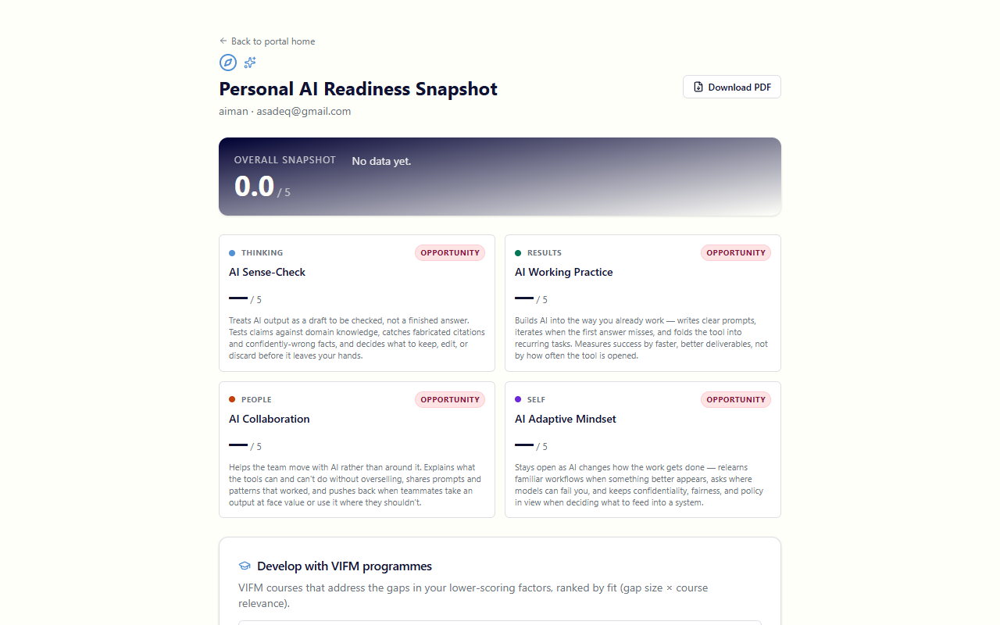

The results page surfaces:

- **Overall score** with **maturity stage badge** (Emerging / Practising / Embedded)
- **Per-factor cards** with score, tone (Strong/Developing/Opportunity), and a sharp behavioural description
- **Vs cohort delta pill** — when you're part of a Mode C engagement, shows your score vs the cohort peer mean (excludes self)
- **Recommended VIFM programmes** — ranked by `gap × course relevance` × ★ HIGH FIT badge for high-confidence matches

#### 4. Download the PDF

Click *Download PDF* on the results page → `/api/ara/personal/<token>/pdf`. One-page bilingual mini-report with your snapshot + course recs.

---

### Client — receiving and using the report

The client side is currently passive. The VIFM consultant delivers the bilingual PDF directly. Optional walkthrough session for Stage 2/3 engagements.

The PDF includes:

- Cover with org name, stage, generation date
- Executive summary — overall maturity, top 3 strengths, top 3 gaps
- Per-pillar deep dives (one section per applicable pillar)
- **Gap heatmap** — visual matrix of gap severity × business impact
- **Investment priority matrix** — Stage 2/3 — quick-wins vs strategic-bets
- **12-month action roadmap** — gantt-style with owner, dependencies, target maturity
- **Compliance summary** — mapped against the UAE/Saudi regulatory frameworks in scope
- **Use-case portfolio review** — Stage 2/3
- **Workforce AI Readiness** — when Mode C is on; cohort + 4 factor table + tier badge
- **Year-on-year comparison** — Stage 3 reassessments

---

## Admin tasks

The admin console at `/ara/admin` is for VIFM staff who curate the knowledge base. Most consultants don't need to touch this.

### Question bank versions

`/ara/admin/questions`

- One version active at a time (`is_active=true`, enforced by partial unique index)
- Each version locks question-text/scoring at the time of an assessment so historical reports remain reproducible
- Version 1.1 is the current active production bank — 218 items (135 pillar + 24 snapshot personal + 32 deep-dive personal + 27 admin extensions)

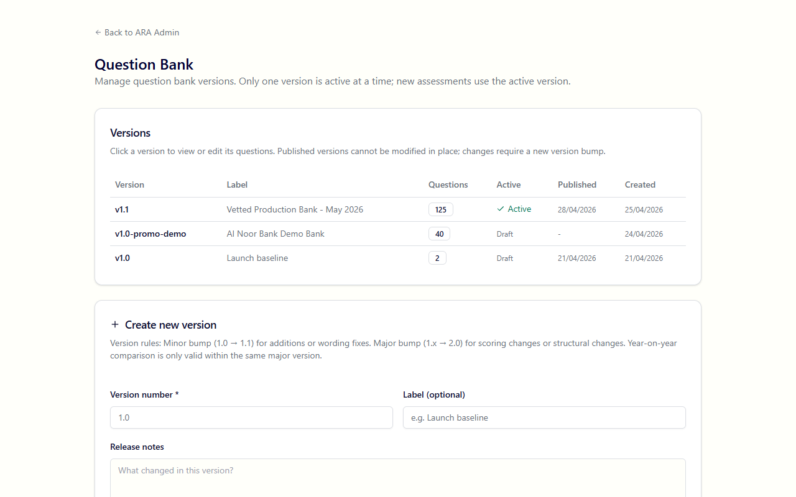

### Regulatory document upload + AI extraction

`/ara/admin/regulatory`

Upload a regulatory PDF (UAE PDPL, NCA ECC, etc.) and Claude reads it, extracts requirements, maps them to pillars, and stages them for review.

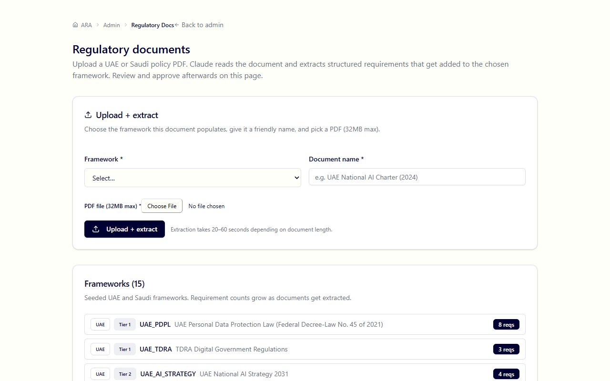

### Sandbox cleanup

`/ara/admin/sandbox`

Hard-delete every assessment marked `is_sandbox=true`. Confirmation phrase required ("DELETE SANDBOX DATA"). Useful after training sessions / demos.

### Retention purge

`/ara/admin/retention`

Hard-delete archived assessments past the retention window (default 3 years). Generated reports are detached and survive — they're VIFM business records.

A daily cron at `/api/ara/admin/retention/cron` runs the same logic automatically (gated on `CRON_SECRET`).

---

## Reference

### The four engagement stages

| Stage | Pillars | Stakeholders | Report | Price |
|---|---|---|---|---|
| **Personal** | 4 personal factors | 1 | 1-page bilingual snapshot | Free, self-served |
| **Stage 1 — Department** | 4 of 8 | 1–2 | 8-page bilingual | Complimentary |
| **Stage 2 — Division** | 6 of 8 | 4–8 | 27-page bilingual | Fee-based |
| **Stage 3 — Enterprise** | 8 of 8 | 8–15+ | 27–60-page side-by-side | Fee-based |

### The eight organisational pillars

| Pillar | What it covers |
|---|---|
| **Strategy** | AI vision, alignment to business goals, executive sponsorship |
| **Data** | Data quality, accessibility, lineage, governance, sovereignty |
| **Technology** | Compute, MLOps platforms, integration, vendor selection |
| **Talent** | Skills inventory, hiring, retention, training programmes |
| **Culture** | Adoption mindset, change readiness, psychological safety with AI |
| **Governance** | Ethics, risk frameworks, model cards, audit trail |
| **Operations** | Day-to-day AI deployment patterns, incident response |
| **Model Management** | Version control, monitoring, retraining, drift detection |

### The four personal factors

| Factor | Domain | What it measures |
|---|---|---|
| **AI Sense-Check** | THINKING | Critical evaluation of AI output, hallucination detection |
| **AI Working Practice** | RESULTS | Productive hands-on use of AI in real workflows |
| **AI Collaboration** | PEOPLE | Helping the team move with AI, shaping shared norms |
| **AI Adaptive Mindset** | SELF | Curiosity, openness to relearning, responsible posture |

### The maturity-stage narrative

Applied to a respondent's overall four-factor average:

| Score | Stage | What it means |
|---|---|---|
| < 3.0 | **Emerging** | Foundation-laying — early exposure, room to build core habits and judgment |
| 3.0–3.99 | **Practising** | Building rhythm — using AI on real work, sharpening prompts and review habits |
| ≥ 4.0 | **Embedded** | Operating fluently — AI is part of how you work, with confident judgment about when to lean on it |

### Scoring scale

Likert 1–5 across all factors and pillars:

| Score | Label |
|---|---|
| 1 | Initial — ad-hoc, no structure |
| 2 | Developing — pockets of activity |
| 3 | Defined — documented, repeatable |
| 4 | Managed — measured, governed |
| 5 | Optimised — continuously improved |

### Regulatory frameworks calibrated

**UAE (7):** PDPL · NCA ECC · DCAI · ADDA · UAE AI Strategy 2031 · NESA · TDRA AI Ethics

**Saudi Arabia (9):** SDAIA NDGF · NCA ECC · NDGA · DCAI Health · SDAIA AI Ethics · Vision 2030 · Cyber Security Framework · Cloud Computing Regulatory Framework · NDMO

### URL map

| URL | Who | Purpose |
|---|---|---|
| `/ara` | Public | Landing page |
| `/ara/engage` | Public | Stage comparison + sales pitch |
| `/ara/roadmap` | Public | Platform overview |
| `/ara/personal/start` | Public | Free Mode A snapshot entry |
| `/ara/personal/results/[token]` | Respondent | Personal results + cohort delta |
| `/api/ara/personal/[token]/pdf` | Respondent | Personal snapshot PDF |
| `/ara/respond/[token]` | Respondent | Survey form (token-gated) |
| `/ara/consultant` | Consultant | Dashboard |
| `/ara/consultant/assessments/new` | Consultant | New assessment wizard (org-side) |
| `/ara/consultant/personal-deep-dive/new` | Consultant | New paid Mode B deep-dive |
| `/ara/consultant/assessments/[id]` | Consultant | Assessment detail (Phase 2 tab) |
| `/api/ara/reports/[id]/pdf` | Consultant | Bilingual PDF report endpoint |
| `/ara/admin` | Admin | Admin console |
| `/ara/admin/questions` | Admin | Bank version management |
| `/ara/admin/regulatory` | Admin | Regulatory doc import |
| `/ara/admin/sandbox` | Admin | Sandbox cleanup |
| `/ara/admin/retention` | Admin | Retention purge |

---

*Last updated: 2026-04-29.*
